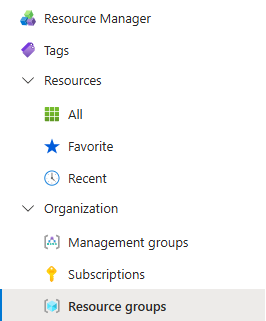
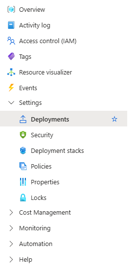
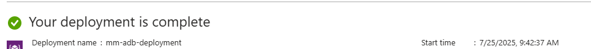
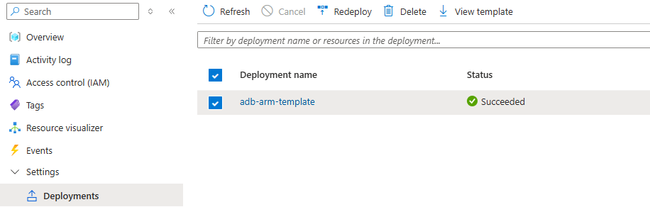

# Creating an Autonomous Database using Azure Infrastructure-as-Code tools

## Introduction

There are many ways to provision an Autonomous Database@Azure: you can use the console for a seamless, new user friendly experience. For more experienced or those who are more DevOps inclined, you can use IaC (Infrastructure-as-code) tools to provision infrastructure through programming tools, such as the API, CLI, or Terraform. Additionally, Azure offers a user-friendly language called Bicep, which acts as an alternative to ARM templates or Terraform, which can often be challenging to read.

In this workshop, you will earn how to provision Oracle Autonomous Database using a variety of IaC tools. 
## Documentation 

What is Bicep? - https://learn.microsoft.com/en-us/azure/azure-resource-manager/bicep/overview?tabs=bicep
Azure Resource Manager - https://learn.microsoft.com/en-us/azure/azure-resource-manager/management/overview
Oracle Database@Azure - https://www.oracle.com/cloud/azure/oracle-database-at-azure/
Oracle Autonomous Database@Azure Bicep reference - https://learn.microsoft.com/en-us/azure/templates/oracle.database/autonomousdatabases?pivots=deployment-language-bicep

## Task 1: Write Bicep code
1. Open a terminal with Azure CLI installed, In this example I will use Azure's Cloud Shell
    

2. In the terminal, create a file called main.bicep
    ```
    code main.bicep
    ```
3. In this file, paste the following content.

    ```
    resource autonomousDatabases_db_name_resource 'Oracle.Database/autonomousDatabases@2025-03-01' = {
    location: '<location>'
    name: 'testbicepdeployment'
    properties: {
        adminPassword: '<example_password>'
        backupRetentionPeriodInDays: 60
        characterSet: 'AL32UTF8'
        computeCount: 2
        computeModel: 'ECPU'
        customerContacts: [
            {
                email: '<email>'
            }
        ]
        dataStorageSizeInTbs: 1
        dbVersion: '23ai'
        dbWorkload: 'OLTP'
        displayName: 'DisplayName'
        isAutoScalingEnabled: true
        isAutoScalingForStorageEnabled: true
        isLocalDataGuardEnabled: false
        isMtlsConnectionRequired: true
        isPreviewVersionWithServiceTermsAccepted: false
        licenseModel: 'LicenseIncluded'
        localAdgAutoFailoverMaxDataLossLimit: 0
        longTermBackupSchedule: {
            isDisabled: false
            repeatCadence: 'Monthly'
            retentionPeriodInDays: 90
        }
        ncharacterSet: 'AL16UTF16'
        openMode: 'ReadWrite'
        permissionLevel: 'Unrestricted'
        scheduledOperations: {
            dayOfWeek: {
                name: 'Sunday'
            }
        }
        dataBaseType: 'Regular'
        // For remaining properties, see AutonomousDatabaseBaseProperties objects
        }
    }
    ```
    Before we continue, let's discuss what these fields mean.

    `location` - Region the Autonomous Database will be deployed in.

    `name` - Name of the resource.

    `adminPassword` - This is the password of the ADMIN user which is provisioned by default.

    There are restrictions on what this password can contain.
    
    * The password must be between 12 and 30 characters long and must include at least one uppercase letter, one lowercase letter, and one numeric character.

    * The password cannot contain the username.

    * The password cannot be one of the last four passwords used for the same username.

    * The password cannot contain the double quote (") character.

    * The password must not be the same password that is set less than 24 hours ago. 

    `backupRetentionPeriodInDays` - This field determines how long a backup is maintained for the Database, you can choose a value between 1 and 60 (days).

    `characterSet` - Oracle supports most ASCII-based character sets. You can find the list here: https://docs.oracle.com/en/database/oracle/oracle-database/23/nlspg/appendix-A-locale-data.html#GUID-A9E30C27-FD47-4552-B670-F41A95B11405

    Generally `AL32UTF8` is sufficient for most use cases. 

    `computeCount` - Determines the number of CPUs to allocate to this database.

    `computeModel` - An OCPU is defined as the equivalent of one physical core with hyper-threading enabled. In contrast, an ECPU is not explicitly defined in terms of an amount of physical hardware. 

    `customerContacts` - The email address used by Oracle to send notifications regarding databases and infrastructure.

    `dataStorageSizeInTbs` - The amount of storage in Terabytes. Alternatively you can use the field `dataStorageSizeInGbs` but you cannot use both at the same time.

    `dbVersion` - The version of database to use, supported values are `19c` and `23ai`.

    `dbWorkload` - The type of workload this database is designed for. Supported values are         
        `AJD` - Autonomous JSON Database
        `APEX` - APEX database 
        `DW` - Data Warehouse
        `OLTP` - Online Transaction Processing.

    `isAutoScalingEnabled` - Determines if the CPU count will auto scale, up to a maximum of 3x the current CPU count.

    `isAutoScalingForStorageEnabled` - Determines if storage will auto scale, up to 3x the base storage value. 

    `isLocalDataGuardEnabled` - Data Guard is responsible for maintaining and monitoring standby databases to ensure Oracle Databases remain highly available. If this option is enabled, it will create a standy database in the same location. 

    `isMtlsConnectionRequired` - If enabled, it will require clients to use a wallet to access the database. The wallet can be retrieved after the database is provisioned. 

    `isPreviewVersionWithServiceTermsAccepted` - Determines if this database has the capability to use preview versions of ADB. 

    `licenseModel` - If you are bringing your own license, use `BYOL`, else you should use `LicenseIncluded`.

    `localAdgAutoFailoverMaxDataLossLimit` - Determines how much data loss is acceptable until the automatic failover is triggered. 

    `longTermBackupSchedule` - This field is responsible for determining the backup schedule.
        `isDisabled` - Determines if the long-term backup schedule should be deleted.
        `repeatCadence` - How often should backups be taken.
        `retentionPeriodInDays`- how long should the backups be retained (in days).
    `ncharacterSet` - Additional character set to be used in conjunciton with the `characterSet`. You can find a list here: https://docs.oracle.com/en/database/oracle/oracle-database/23/nlspg/supporting-multilingual-databases-with-unicode.html#GUID-AA09A60E-123E-457C-ACE1-89E4634E492C

    `openMode` - This determines what read/write access users should have. Options include `ReadOnly` and `ReadWrite`.

    `permissionLevel` - Determines who sould have access to the database. Valid options are 
    
    `Restricted` for `ADMIN` only access.
    `Unrestricted` otherwise.

    `scheduledOperations` - Determines when maintenance operations should be scheduled.
        `dayOfWeek` - The day when maintenance should occur.

4. Execute deployment command
    ```
    az deployment group create --name mm-adb-deployment --resource-group code-innovate --template-file main.bicep
    ```
5. Wait for resources to build.

## Task 2: Validate deployment creation
1. Go into Azure Resource Manager

2. Go to Organization > Resource Groups > (Your resource group)

    

3. Go to Settings > Deployments > (your deployment)

    

4. Validate your deployment has been created.

    

## Task 3: Create Autonomous Database@Azure using ARM templates

1. Access terminal with Azure CLI installed and configured, in this example I will use Azure Cloud Shell.

2. Create resource group

    ```
    az group create --location eastus --name <example_resource_group>
    ```

3. Create ARM deploy file

    ```
    code azuredeploy.json
    ```

4. Paste the following

    ```
            {
        "$schema": "https://schema.management.azure.com/schemas/2019-04-01/deploymentTemplate.json#",
        "contentVersion": "1.0.0.0",
        "resources": [
            {
                "type": "Oracle.Database/autonomousDatabases",
                "apiVersion": "2025-03-01",
                "name": "testbicepdeployment",
                "location": "eastus",
                "properties": {
                    "adminPassword": "dbatazurepassword098",
                    "backupRetentionPeriodInDays": 60,
                    "characterSet": "AL32UTF8",
                    "computeCount": 2,
                    "computeModel": "ECPU",
                    "customerContacts": [
                    {
                        "email": "<insert_email>"
                    }
                    ],
                    "dataStorageSizeInTbs": 1,
                    "dbVersion": "23ai",
                    "dbWorkload": "DW",
                    "displayName": "DisplayName",
                    "isAutoScalingEnabled": false,
                    "isAutoScalingForStorageEnabled": false,
                    "isLocalDataGuardEnabled": false,
                    "isMtlsConnectionRequired": true,
                    "isPreviewVersionWithServiceTermsAccepted": false,
                    "licenseModel": "LicenseIncluded",
                    "localAdgAutoFailoverMaxDataLossLimit": 0,
                    "longTermBackupSchedule": {
                        "isDisabled": false,
                        "repeatCadence": "Monthly",
                        "retentionPeriodInDays": 90
                    },
                    "ncharacterSet": "AL16UTF16",
                    "openMode": "ReadWrite",
                    "permissionLevel": "Unrestricted",
                    "scheduledOperations": {
                        "dayOfWeek": {
                            "name": "Sunday"
                        }
                    },
                    "dataBaseType": "Regular"
                    // For remaining properties, see AutonomousDatabaseBaseProperties objects
                }
            }
        ]
        }
    ```

    **NOTE**: the configuration above is identical to the Bipec example from earlier. 

5. Create ARM template

    ```
    az deployment group create --name adb-arm-template --resource-group code-innovate-iac --template-file ./azuredeploy.json
    ```

6. Validate that the deployment has been created. Go to Resource Groups > Settings > Deployments

    

## Task 3: Using Terraform to provision Autonomous Database@Azure

1. Open a terminal with access to Terraform. In this example I am using Azure Cloud Shell.

2. Create a file called `main.tf`

3. Create Terraform provider within `main.tf`

    ```
    terraform {
        required_providers {
            azapi = {
            source = "Azure/azapi"
            }
            azurerm = {
            source = "hashicorp/azurerm"
            }
        }
    }
    ```

4. Create `azurerm` provider

    ```
    provider "azurerm" {
        resource_provider_registrations = "none"
        subscription_id = "<subscription_ID"
        features {}
    }
    ```

5. Create resource group data source

    ```
    data "azurerm_resource_group" "resource_group" {
        name = "<resource_group>"
    }
    ```
6. Create Autonomous Database resource

    ```
    resource "azapi_resource" "autonomous_db" {
        type                      = "Oracle.Database/autonomousDatabases@2023-09-01"
        parent_id                 = data.azurerm_resource_group.resource_group.id
        name                      = "testbicepdeployment"
        schema_validation_enabled = false
        
        body = {
            "location" : "eastus",
            "properties" : {
            "displayName" : "DisplayName",
            "computeCount" : 2,
            "dataStorageSizeInTbs" : 1,
            "adminPassword" : "Dbatazurepassword098",
            "dbVersion" : "23ai",
            "licenseModel" : "LicenseIncluded",
            "dataBaseType" : "Regular",
            "computeModel" : "ECPU",
            "dbWorkload" : "DW",
            "permissionLevel" : "Restricted",
        
            "characterSet" : "AL32UTF8",
            "ncharacterSet" : "AL16UTF16",
        
            "isAutoScalingEnabled" : false,
            "isAutoScalingForStorageEnabled" : false,

            "isMtlsConnectionRequired": true,

            }
        }
        response_export_values = ["id", "properties.ocid", "properties"]
    }
    ```

